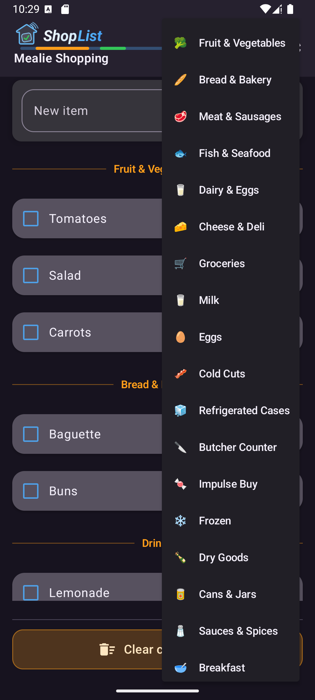
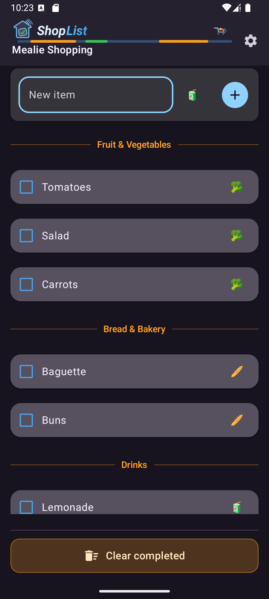
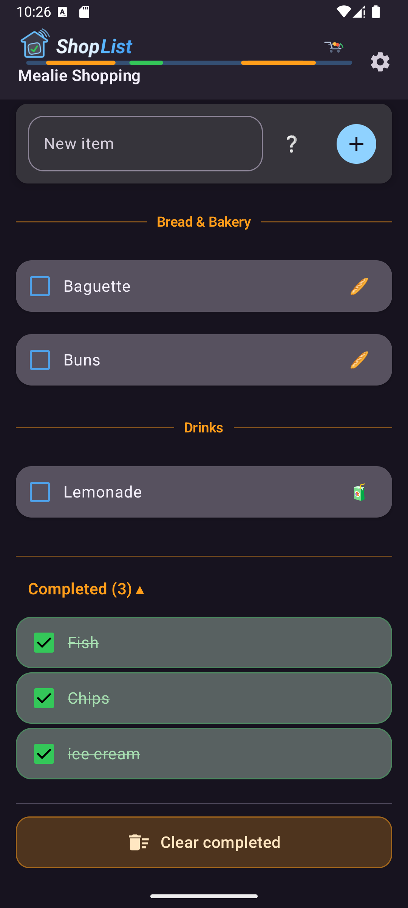
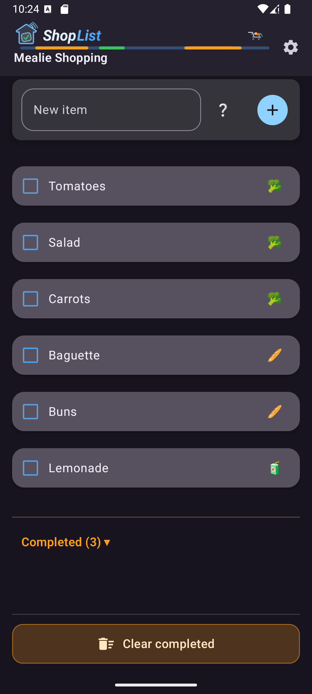
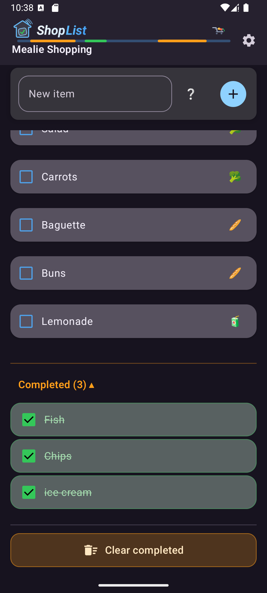
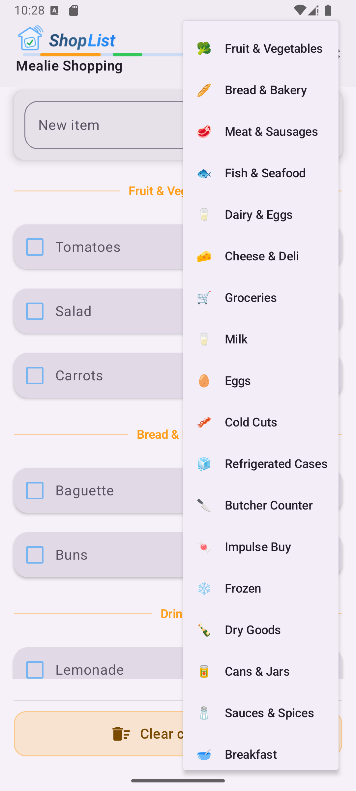
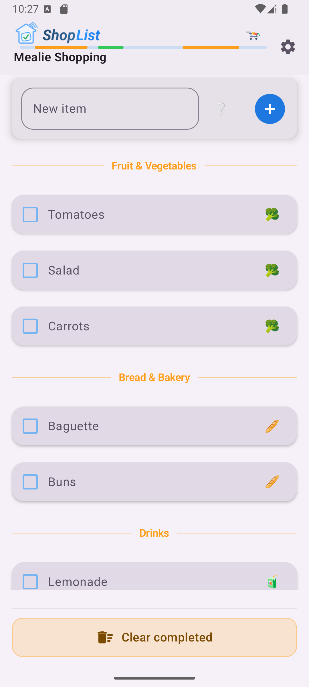
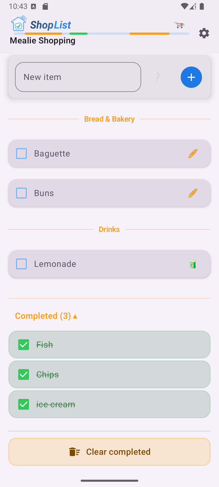
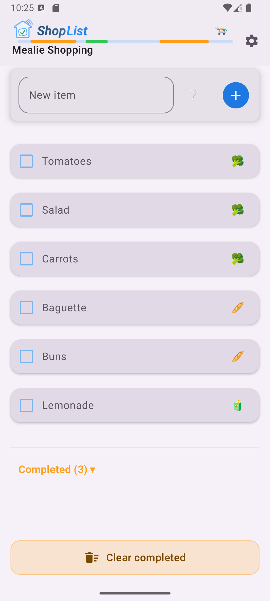
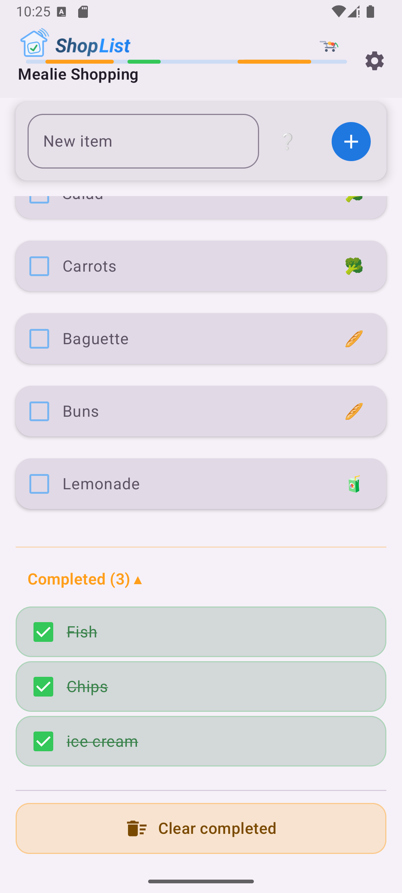

# Home ShopList (Android)

## Wichtiger Hinweis zum Update

- Ab Version `1.8` verwendet die App eine neue App-ID.
- Wenn du aktuell eine Version unter `1.8` nutzt, kannst du nicht direkt per In-App-Update auf `1.8` aktualisieren.
- Bitte deinstalliere in diesem Fall zuerst die alte App und installiere danach Version `1.8` oder neuer manuell neu.
- Danach funktionieren künftige Updates auch wieder ganz normal in der App.

---

Standalone-Android-App für die **Home Assistant Todo-Listen** mit Live-Updates über die Home Assistant WebSocket API.

---

## Inhaltsverzeichnis

- [Installation](#installation)
- [Long-Lived Access Token in Home Assistant erstellen](#long-lived-access-token-in-home-assistant-erstellen)
- [Konfiguration](#konfiguration)
- [Items kategorisieren](#items-kategorisieren)
- [Items umbenennen](#items-umbenennen)
- [Items sortieren](#items-sortieren)
- [Settings](#settings)
- [Erledigte Items löschen](#erledigte-items-löschen)
- [Screenshots](#screenshots)
---

## Installation

Lade die aktuelle APK aus den **[Releases](https://github.com/robNice/HA-ShopList/releases)** herunter.

---

## Long-Lived Access Token in Home Assistant erstellen

Damit sich die App mit Home Assistant verbinden kann, wird ein **Long-Lived Access Token** benötigt.

So erstellst du ihn:

1. Öffne deine **Home Assistant Oberfläche**
2. Klicke unten links auf dein **Benutzerprofil**
3. Scrolle zum Abschnitt **Long-Lived Access Tokens**
4. Klicke auf **Create Token**
5. Vergib einen Namen (z. B. `HA Shopping List`)
6. Kopiere den erzeugten Token

⚠️ Der Token wird **nur einmal angezeigt**. Speichere ihn daher direkt ab.

---

## Konfiguration

Beim ersten Start öffnet sich automatisch der **Settings-Screen**.

Dort müssen folgende Einstellungen gesetzt werden:

### Home Assistant URL
Die URL deiner Home Assistant Instanz (inkl. eventuellen Port).  
Die App normalisiert die URL automatisch.

### Token
Hier wird der zuvor erzeugte **Long-Lived Access Token** eingefügt.

### Liste

Nach Eingabe von URL und Token lädt die App automatisch alle verfügbaren **Home Assistant Todo-Listen (`todo.*`)**.

Diese erscheinen als **Dropdown-Auswahl**.

Die ausgewählte Liste wird gespeichert und beim nächsten Start automatisch wieder verwendet.

---

## Items kategorisieren

Items können auf mehreren Wegen Kategorien zugewiesen werden.

### Beim Hinzufügen

Vor dem Hinzufügen kann neben dem Eingabefeld die gewünschte Kategorie ausgewählt werden.

### In der Liste

Offene Items lassen sich direkt in der Liste kategorisieren:

1. Ein Item in eine andere Kategorie einsortieren, um Position und Kategorie gleichzeitig zu ändern
2. Die Kategorie über den Kategorie-Button am Item ändern

---

## Items umbenennen

Ein vorhandenes Item kann direkt in der Liste umbenannt werden.

Vorgehen:

1. Auf den **Item-Text tippen**
2. Das Eingabefeld erscheint
3. Neuen Namen eingeben
4. Mit **Enter / Done** bestätigen

Die Änderung wird sofort an Home Assistant übertragen.

---

## Items sortieren

Offene Items können per **Drag & Drop** neu sortiert werden.

Vorgehen:

1. Ein Item **lange gedrückt halten**
2. Item an die gewünschte Position ziehen
3. Loslassen

Die neue Reihenfolge wird automatisch in Home Assistant gespeichert.

---

## Settings

Im Settings-Screen gibt es außerdem Optionen für Listenanzeige und Bereiche.

### Listenanzeige

Die Liste kann wahlweise angezeigt werden als:

- **Simple**
- **Kategorisiert**

### Bereichseditor

Im Bereichseditor lassen sich:

- Bereiche aktivieren oder deaktivieren
- die Reihenfolge der Bereiche ändern

---

## Erledigte Items löschen

Erledigte Items können gesammelt entfernt werden.

Vorgehen:

1. Zum unteren Bereich der Liste scrollen
2. **„Erledigte löschen“** auswählen
3. Löschvorgang im Dialog bestätigen

Alle erledigten Items werden anschließend aus der Liste entfernt.

## Screenshots

