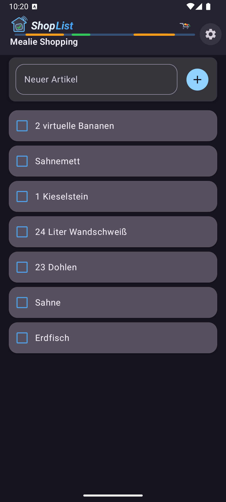
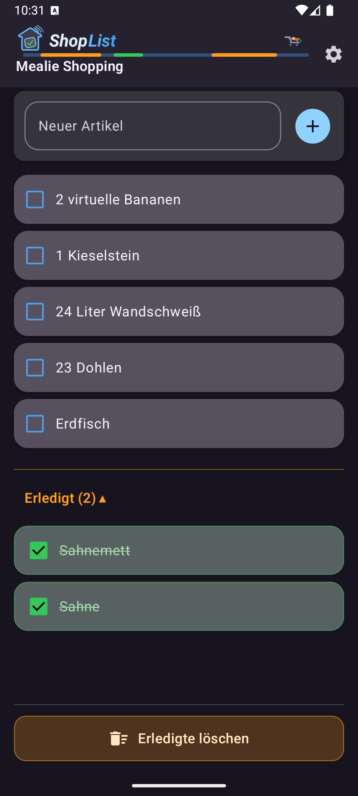
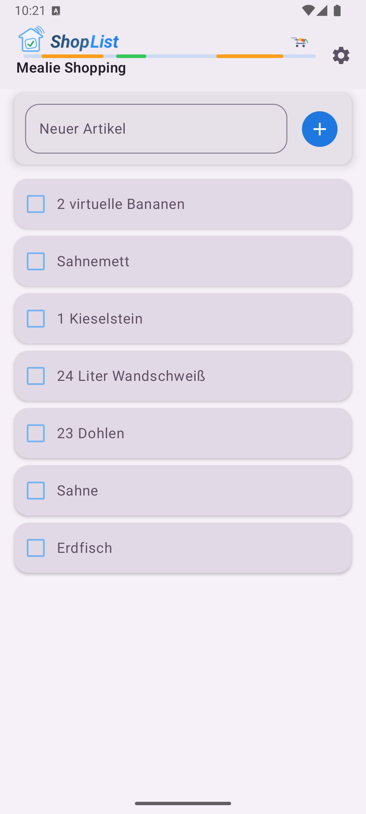
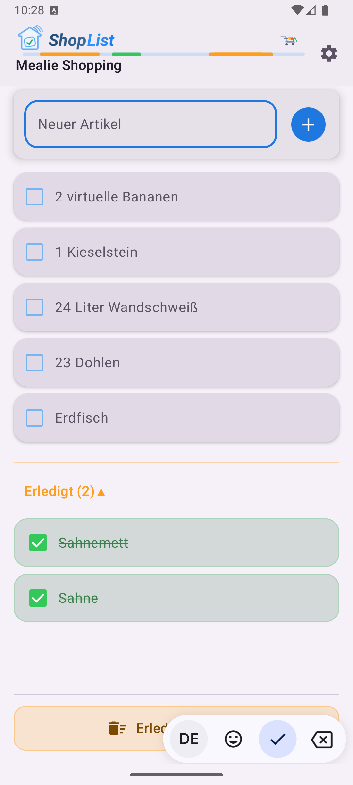

# HA Shopping List (Android)

Standalone Android app for **Home Assistant Todo Lists** with live updates via the Home Assistant WebSocket API.

---

## Table of Contents

- [Installation](#installation)
- [Create a Long-Lived Access Token in Home Assistant](#create-a-long-lived-access-token-in-home-assistant)
- [Configuration](#configuration)
- [Rename Items](#rename-items)
- [Sort Items](#sort-items)
- [Delete Completed Items](#delete-completed-items)
- [Screenshots](#screenshots)

---

## Installation

Download the latest APK from **[Releases](https://github.com/robNice/HA-ShopList/releases)**.

---

## Create a Long-Lived Access Token in Home Assistant

The app requires a **Long-Lived Access Token** to connect to Home Assistant.

To create one:

1. Open your **Home Assistant interface**
2. Click your **user profile** in the bottom left
3. Scroll to the **Long-Lived Access Tokens** section
4. Click **Create Token**
5. Enter a name (e.g. `HA Shopping List`)
6. Copy the generated token

⚠️ The token is **only shown once**, so make sure to save it immediately.

---

## Configuration

When the app is started for the first time, the **Settings screen** opens automatically.

The following settings must be configured:

### Home Assistant URL
The URL of your Home Assistant instance (including port if necessary).  
The app automatically normalizes the URL.

### Token
Enter the previously created **Long-Lived Access Token** here.

### List

After entering the URL and token, the app automatically loads all available **Home Assistant Todo Lists (`todo.*`)**.

These appear as a **dropdown selection**.

The selected list is saved and automatically reused the next time the app starts.

---

## Rename Items

An existing item can be renamed directly in the list.

Steps:

1. Tap the **item text**
2. The input field appears
3. Enter the new name
4. Confirm with **Enter / Done**

The change is immediately sent to Home Assistant.

---

## Sort Items

Open items can be reordered using **drag & drop**.

Steps:

1. **Press and hold** an item
2. Drag the item to the desired position
3. Release it

The new order is automatically saved in Home Assistant.

---

## Delete Completed Items

Completed items can be removed in bulk.

Steps:

1. Scroll to the bottom area of the list
2. Select **“Delete completed items”**
3. Confirm the deletion in the dialog

All completed items will then be removed from the list.

## Screenshots

